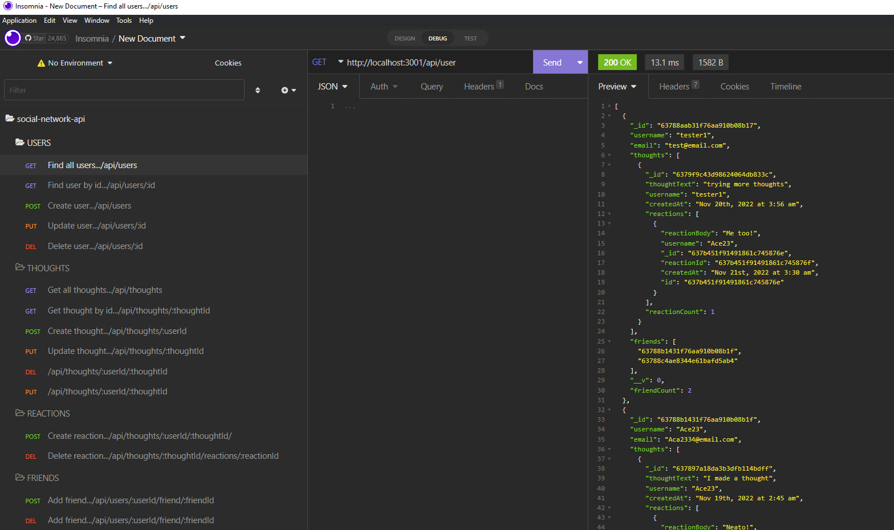
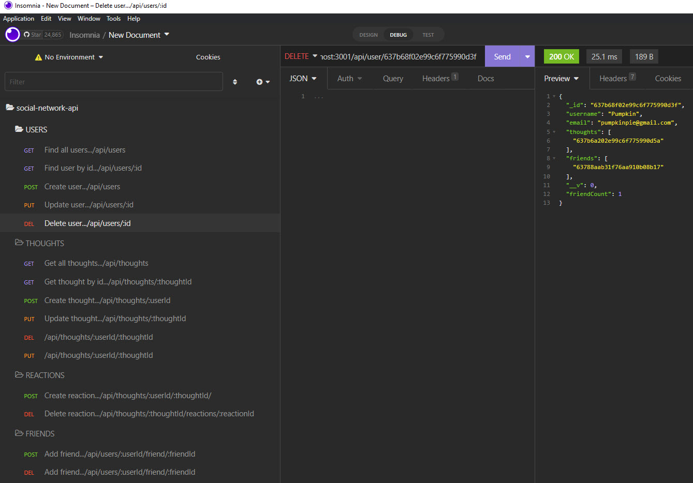

# Social-Network-API

## Description

The Social-Networking-API is a ready to use API for a Social Networking application. Just connect to the front-end application and you are set! This API uses Node.js Mongoose library for a MongoDB NoSQL database to provide the flexiblity to change the information you need to collected.

---

## Table of Contents

- [Installation](#installation)
- [Usage](#usage)
- [Contributing](#contributing)
- [Tests](#tests)
- [Questions](#questions)

---

## Installation

Clone the repository, run npm install, and you are ready to start and test the server to connect the front-end application.

---

## Usage

Free to use

---

## Contributing

Provide credit to this repository

---

## Tests

No tests created

---

## Questions

Please contact the owner with any questions.
Email: yiladien@hotmail.com
GitHub profile: https://github.com/Yiladien

---
